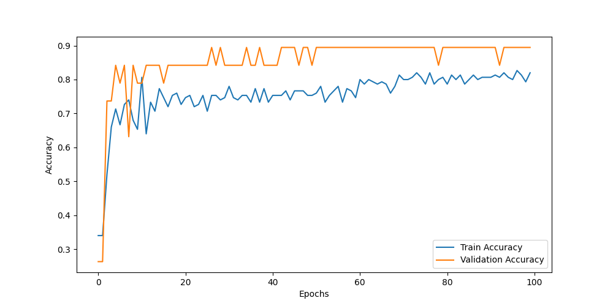

# Graph Neural Network (GNN) Final Project

This repository contains the final project for the **Topics in Geometric Deep Learning** course. The project focuses on **graph classification** using various GNN architectures, with detailed experimentation and analysis.

---

## 📜 Project Overview

### Objective
The objective of this project was to build a **graph classification model** that can effectively classify graphs into binary classes. We explored different architectures and introduced Gaussian-enhanced models to handle uncertainty in node embeddings.

### Key Architectures
We implemented and evaluated the following GNN architectures:
- **Graph Attention Network (GAT)**
- **GraphSAGE**
- **Gaussian-enhanced GAT**
- **Gaussian-enhanced GraphSAGE**

The Gaussian-enhanced models introduced uncertainty by learning Gaussian embeddings, represented by means and variances, using reparameterization and KL divergence regularization.

### Key Results
The **GraphSAGE** model with dropout proved to be the most stable and accurate, achieving:
- **Training Accuracy**: ~0.95-1.0
- **Validation Accuracy**: Stable and high performance with fine-tuned hyperparameters.

For details, see the [report.pdf](report.pdf).

---

## 📊 Results Visualization

### Accuracy
The following chart visualizes the training and validation accuracy over 100 epochs:


- The training accuracy gradually improves to ~0.95.
- Validation accuracy stabilizes around ~0.9, showcasing the model's generalization ability.

## 🛠️ Setup and Installation

### Install Dependencies
Ensure you have Python installed (version 3.8 or higher is recommended). Install the necessary Python libraries by running the following command in the terminal:

```bash
pip install -r requirements.txt

---

### Run the Project
This section provides instructions to run the main script (`main.py`) or other relevant files. You can include command-line instructions to ensure the user knows exactly what to do.

#### Example
```markdown
### Run the Project
To train and evaluate the GNN models, use the following command:

```bash
python main.py


---

### Repository Structure
Explain the purpose of each file or directory in the project.

#### Example
```markdown
## 📁 Repository Structure

- **`main.py`**: The primary script to train and evaluate the GNN models.
- **`models.py`**: Defines the architectures for GraphSAGE, GAT, and Gaussian-enhanced models.
- **`q2_wandb.py`**: Tracks experiment metrics such as training accuracy, loss, and validation metrics using Weights & Biases (wandb).
- **`requirements.txt`**: Lists all dependencies required to run the project.
- **`accuracy.png`**: A visual representation of the training and validation accuracy over epochs.
- **`report.pdf`**: The final project report detailing methodology, experiments, results, and conclusions.
